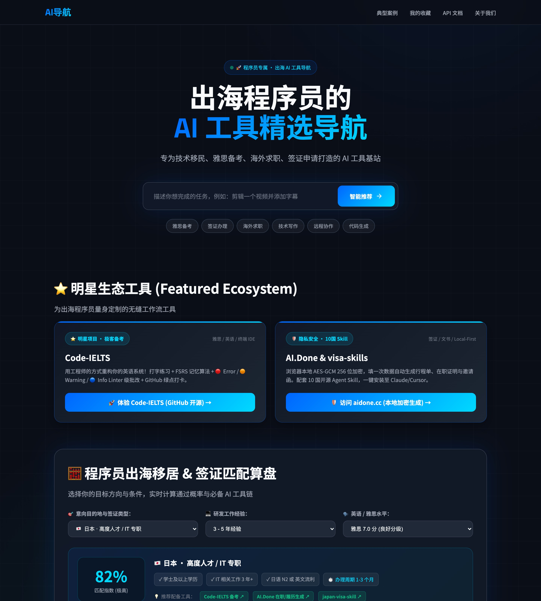

# AI 出海工具站 · 程序员专属

**Slogan：** 出海程序员的 AI 工具精选导航

> 专注于帮助准备**技术移民、海外求职、雅思备考、签证申请、远程协作**的程序员找到最合适的 AI 工具。

🌐 **在线访问：** https://x.aimake.cc

## ✨ 核心亮点功能

1. **⭐ 明星生态工具引流区 (Featured Ecosystem)**：顶部强力展示 `code-ielts`（极客雅思 IDE）与 `AI.Done`（Local-First 签证文书），构建矩阵流量闭环。
2. **🧮 程序员出海移居 & 签证匹配算盘 (Interactive Calculator)**：根据程序员选定的目标国家（日本高度人才/西班牙游民/泰国DTV/新加坡EP/加拿大EE）、研发经验与雅思水平，**实时计算匹配分数、展示签证条件并一键匹配 AI 工具链**。
3. **🤖 智能任务推荐与工作流生成的双重模式**：支持输入自然语言（如“我想准备申根签证材料”），自动生成智能推荐与多步骤流程图。

---

## 🖼️ 界面展示



---

## ✨ 精选自研工具

这两款工具是为出海程序员专门打造的，**强烈推荐**：

| 工具 | 场景 | 特点 |
|------|------|------|
| 🔥 **[code-ielts](https://github.com/chicogong/code-ielts)** | 雅思备考 / 英语学习 | 程序员专属开源 IDE：Linter 级 AI 批改 + Keyboard-First 打字背词 + GitHub 绿点打卡 |
| 🔥 **[aidone.cc](https://aidone.cc)** | 签证申请 / 移民材料 | 本地加密文书生成器：行程单/证明信/简历一键导出 PDF，数据完全不上云 |

---

## 🗂️ 工具分类

| 场景 | 精选工具 |
|------|---------|
| 🎓 **雅思备考** | code-ielts、Write & Improve、Grammarly |
| 📝 **英语学习** | code-ielts、Qwerty Learner、ChatGPT |
| 🛂 **签证申请** | aidone、visa-skills、Kimi |
| ✈️ **技术移民** | aidone、visa-skills、Claude |
| 💼 **海外求职** | ChatGPT、Claude、LinkedIn、aidone |
| ✍️ **技术写作** | Claude、ChatGPT、Grammarly、DeepL |
| 🌍 **远程协作** | Notion AI、飞书 AI、Loom |
| 💻 **写代码** | Cursor、GitHub Copilot、通义灵码 |
| 🤖 **AI Agent** | Dify、Coze、CrewAI、n8n、LangChain |
| 🔓 **开源工具** | Ollama、Open WebUI、LM Studio、DeepSeek R1、Qwen 3、Llama 4、Mistral |

---

## 🚀 快速体验

```bash
# 智能推荐（自然语言输入）
curl -X POST https://x.aimake.cc/api/recommend \
  -H "Content-Type: application/json" \
  -d '{"query": "我要准备申根签证材料"}'
# → 推荐 aidone + visa-skills

curl -X POST https://x.aimake.cc/api/recommend \
  -H "Content-Type: application/json" \
  -d '{"query": "我想备考雅思出国留学"}'
# → 推荐 code-ielts + Write & Improve
```

---

## 📐 定位说明（换方向记录）

**原定位（2026-06）**：通用 AI 工具推荐导航平台

**新定位（2026-07）**：出海程序员垂直精选工具站

**换方向原因**：
- 通用 AI 导航赛道在 2026 年已高度饱和（Poe、各类 awesome-list 等）
- 垂直化是唯一可持续的差异化策略
- "出海程序员"（技术移民 + 雅思备考 + 海外求职）是有极强付费能力且工具需求明确的群体
- 现有自研工具（code-ielts、aidone）天然适合作为精选，形成内部流量闭环

---

## 🛠️ 技术架构

| 组件 | 技术选型 | 说明 |
|------|---------|------|
| 后端 | Cloudflare Workers + Hono | 边缘计算，全球加速 |
| AI | SiliconFlow + 三模型架构 | Qwen 7B / GLM 4-9B / DeepSeek-V3 |
| 前端 | Vue 3 + Vite | 模块化组件，支持 Dark Mode |
| 安全 | Cloudflare Turnstile | 人机验证防滥用 |

## 本地开发

```bash
cd worker && npm install
echo "SILICONFLOW_API_KEY=your_api_key" > .dev.vars
npx wrangler dev --port 8787

cd ../frontend && npm install && npm run dev
```

## License

MIT
